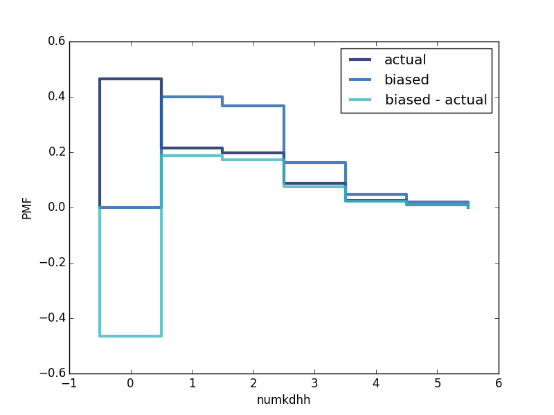

[Think Stats Chapter 3 Exercise 1](http://greenteapress.com/thinkstats2/html/thinkstats2004.html#toc31) (actual vs. biased)

>> From the childrens' perspective there are more kids in the house - well at least one or two.

Code:

    from __future__ import print_function
    import sys
    import thinkstats2
    import thinkplot
    
    
    def readfemresp(dct_file='2002FemResp.dct', dat_file='2002FemResp.dat.gz', nrows=None):
        """Reads the NSFG respondent data.
        Args:
            dct_file: string file name
            dat_file: string file name
            nrows: number of rows to read
        Returns: DataFrame
        """
        dct = thinkstats2.ReadStataDct(dct_file)
        df = dct.ReadFixedWidth(dat_file, compression='gzip', nrows=nrows)
        cleanfemresp(df)
        return df
    
    
    def cleanfemresp(df):
        """Recodes variables from the respondent frame.
        Args:
            df: DataFrame to be cleaned in place.
        Returns: pass
        """
        pass
    
    
    def excercise3_2():
        """
        Explores nsfg NUMKDHH actual vs. biased distributions
        Returns: pass
        Notes: <http://www.icpsr.umich.edu/nsfg6/Controller?displayPage=labelDetails&fileCode=FEM&section=R&subSec=7868&srtLabel=606815>
        """
        df = readfemresp()
    
        actual = df['numkdhh']
        apmf = thinkstats2.Pmf(actual, label='actual')
    
        biased = actual[actual.values > 0]
        bpmf = thinkstats2.Pmf(biased, label='biased')
        bpmf[0] = 0
    
        # difference
        # TODO: why does bpmf-apmf return a Gaussian PMF with negative num of kids?
        dpmf = thinkstats2.Pmf(label='biased - actual')
        nk = range(0, len(apmf))
        for k in nk:
            dpmf[k] = bpmf[k] - apmf[k]
    
        thinkplot.PrePlot(3)
        thinkplot.Pmfs([apmf, bpmf, dpmf])
        thinkplot.Show(xlabel='numkdhh', ylabel='PMF')
    
    
    def main(script):
        """ module main function
        Args:
            script: string path of executing script
        Returns: pass
        """
        excercise3_2()
    
    
    if __name__ == '__main__':
        main(*sys.argv)
