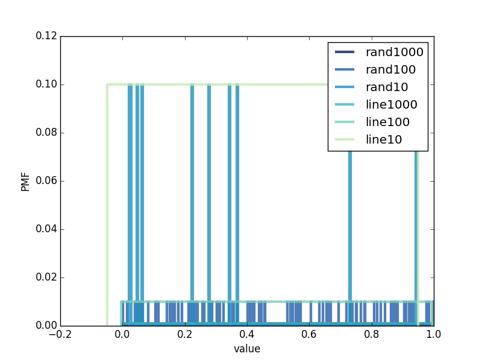
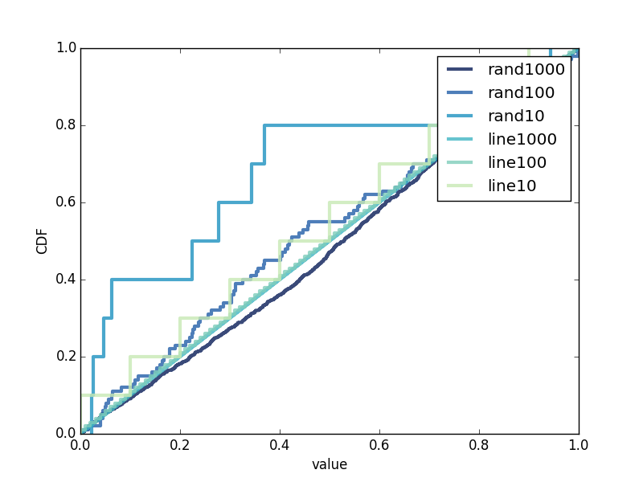

[Think Stats Chapter 4 Exercise 2](http://greenteapress.com/thinkstats2/html/thinkstats2005.html#toc41) (a random distribution)

>> Almost. The np.random.random is pseudo-random as can bee seen by differences from the line in CDFs.  
As resolution increases adherence to the line plot increases.
It would be interesting to expore the same with random numbers from <https://www.random.org/>.

 

Code

    # chap04ex.py
    import thinkstats2
    import thinkplot
    import numpy as np
    
    tensp = [10**p for p in range(3,0,-1)]
    strs10p = [str(tenp) for tenp in tensp]
    rand = [np.random.random(tenp) for tenp in tensp]
    lin = [[x/tenp for x in range(0, tenp)] for tenp in tensp]
    
    pmfs = []
    for f, s in zip(rand, strs10p):
        pmfs.append(thinkstats2.Pmf(f, label='rand'+s))
    for f, s in zip(lin, strs10p):
        pmfs.append(thinkstats2.Pmf(f, label='line'+s))
    thinkplot.PrePlot(len(pmfs))
    thinkplot.Pmfs(pmfs)
    thinkplot.Show(xlabel='value', ylabel='PMF')
    
    cdfs = []
    for f, s in zip(rand, strs10p):
        cdfs.append(thinkstats2.Cdf(f, label='rand'+s))
    for f, s in zip(lin, strs10p):
        cdfs.append(thinkstats2.Cdf(f, label='line'+s))
    thinkplot.PrePlot(len(cdfs))
    thinkplot.Cdfs(cdfs)
    thinkplot.Show(xlabel='value', ylabel='CDF')
