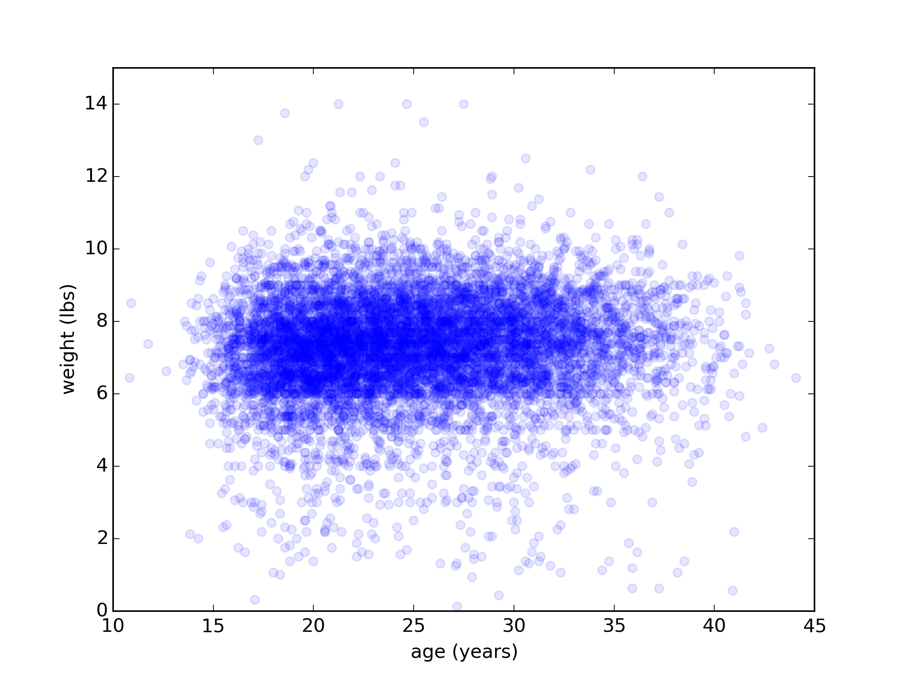
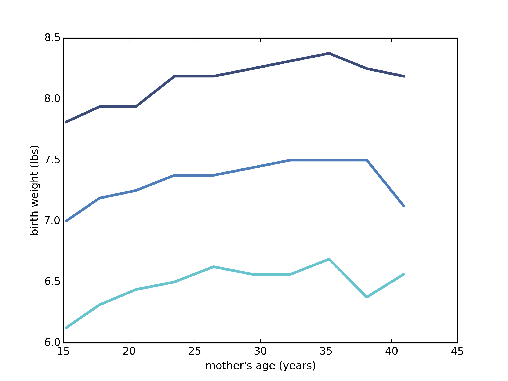

[Think Stats Chapter 7 Exercise 1](http://greenteapress.com/thinkstats2/html/thinkstats2008.html#toc70) (weight vs. age)

Using data from the NSFG, make a scatter plot of birth weight versus mother’s age. Plot percentiles of birth weight versus mother’s age. Compute Pearson’s and Spearman’s correlations. How would you characterize the relationship between these variables?

>> nsfg totalwgt_lb vs agepreg 
correlations: 
- Pearson: 0.624978 
- Spearman: 0.582866 

 

Code

    import sys
    import numpy as np
    import first
    import thinkplot
    import thinkstats2

    print("nsfg totalwgt_lb vs agepreg")

    live, firsts, others = first.MakeFrames()
    live = live.dropna(subset=['agepreg', 'totalwgt_lb'])

    ages = live.agepreg
    weights = live.totalwgt_lb

    # Scatter Plot
    thinkplot.Scatter(ages, weights, alpha=0.1)
    thinkplot.Config(xlabel='age (years)',
                     ylabel='weight (lbs)',
                     xlim=[10, 45],
                     ylim=[0, 15],
                     legend=False)
    thinkplot.Save(root='chap07ex1scatter',
                   legend=False,
                   formats=['png'])

    # Binned Percentiles
    bins = np.arange(10, 48, 3) # [10 13 16 19 22 25 28 31 34 37 40 43 46]
    indices = np.digitize(live.agepreg, bins) # which bin each agepreg goes in [ 8 10  2 ...,  3  4  4]
    groups = live.groupby(indices) # grouped by bins
    ages = [group.agepreg.mean() for i, group in groups][1:-1]
    cdfs = [thinkstats2.Cdf(group.totalwgt_lb) for i, group in groups][1:-1]
    thinkplot.PrePlot(3)
    for percent in [75, 50, 25]:
        weights = [cdf.Percentile(percent) for cdf in cdfs]
        label = '%dth' % percent
        thinkplot.Plot(ages, weights, label=label)
    thinkplot.Save(root='chap07ex1BinPct',
                   formats=['png'],
                   xlabel="mother's age (years)",
                   ylabel='birth weight (lbs)')

    print("correlations:")
    pearsoncor = thinkstats2.Corr(ages, weights)
    spearmancor = thinkstats2.SpearmanCorr(ages, weights)
    print("- Pearson: {0:f}".format(pearsoncor))
    print("- Spearman: {0:f}".format(spearmancor))

